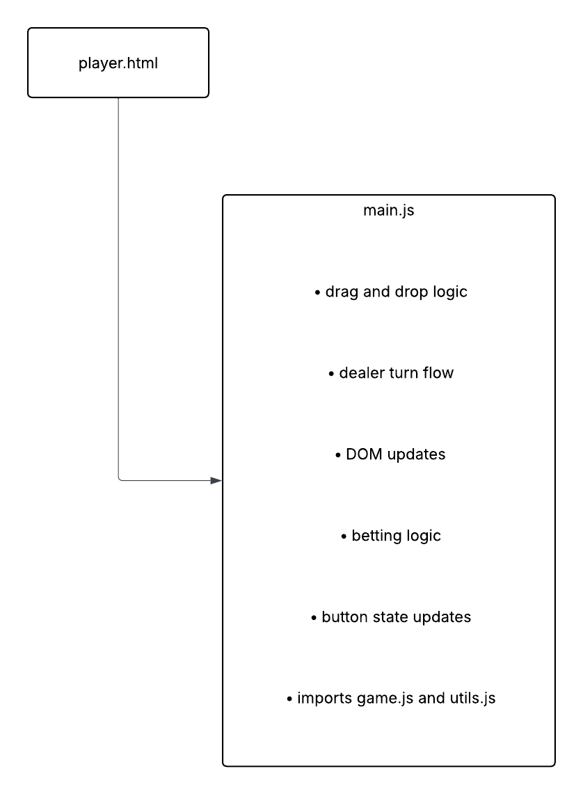
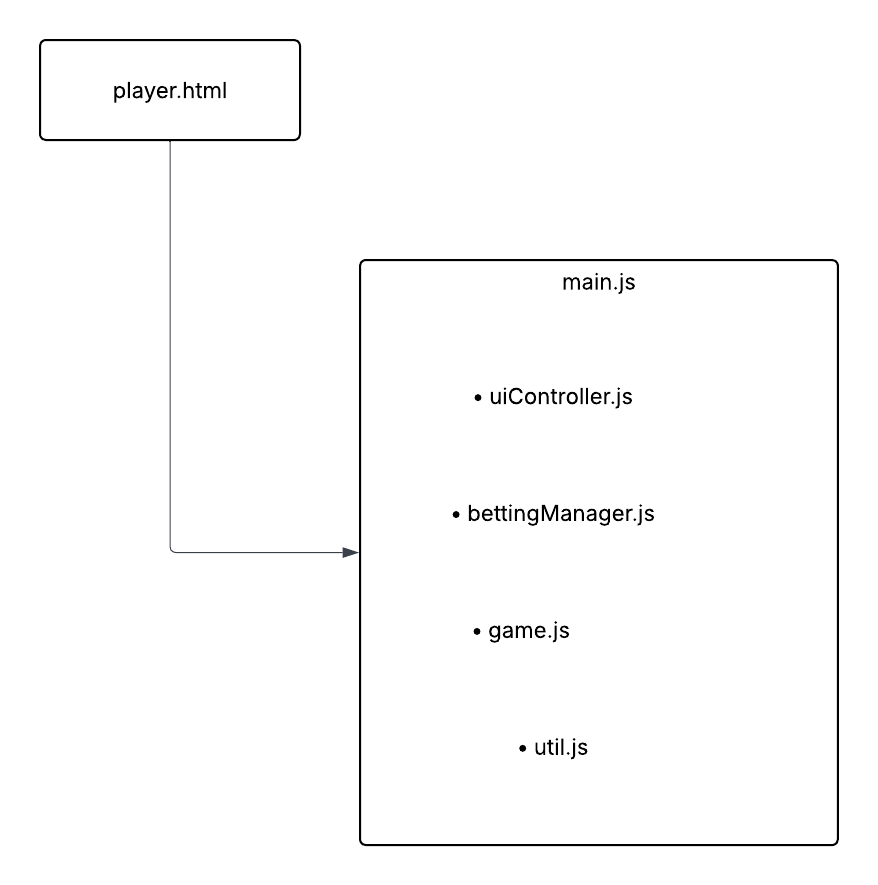

Refactoring Assignment

This repository is my fork of my team’s Assignment 2 Blackjack project for CISC375.

Task 1a : 
The current project has 8 JS files.
scripts/player/card.js defines the Card class and renders a card image element
scripts/player/deck.js creates the deck, shuffles it, and deals cards
scripts/player/game.js stores blackjack game state and rules
scripts/player/main.js controls the player page, event listeners, UI updates, betting flow, dealer turn flow, and round state
scripts/home.js handles joining the game and home page navigation
scripts/instruction.js handles instructions page navigation
scripts/leaderboard.js handles leaderboard page navigation
scripts/utils.js loads the username from local storage and updates the username display

Current Architecture Description:
The project already uses some aspects of ES6 modules in the player game logic. The main separation we had is between Card, Deck, and Game. 
The problem is that scripts/player/main.js still mixes several things together which includes betting updates, button state updates and event listeners. 
This makes the file harder to maintain and test because one file is responsible for both the UI behavior and application flow.

Picture of before diagram:

Task 1b:

I propose separating the player page code into smaller modules with clearer responsibilities.

Proposed Modules:

game.js: Handles blackjack rules and game state.
Exposes:
- startGame()
- hit()
- splitHand()
- doubleCurrentHand()
- surrender()
- finishDealerTurn()
- calculateScore()

uiController.js: Handles DOM rendering and button state updates for the player page.
Exposes:
- showHands()
- updateButtons()
- setActionButtonsDisabled()
- setGameplayActive()
- updateWinLossDisplay()

bettingManager.js: Handles bankroll display, bet display, history display, and round settlement.
Exposes:
- loadInitialBalance()
- updateBettingDisplay()
- updateHistoryList()
- finalizeRound()

main.js: Connects the other modules together and registers event listeners.

Refactor Items
- Separate UI rendering from game flow logic to improve the Single Responsibility Principle
- Move betting and round settlement logic into a dedicated module
- Keep main.js focused on coordination and event handling
- Improve maintainability by reducing how many responsibilities are mixed into one file

Picture of after diagram:

Task 2: Implemented Refactor Changes

Refactor 1: uiController.js
This will separate player-page UI rendering and button-state logic from main.js.

Changes made:
- Moved showHands() into uiController.js
- Moved updateButtons() into uiController.js
- Moved setActionButtonsDisabled() into uiController.js
- Moved setGameplayActive() into uiController.js
- Moved updateWinLossDisplay() into uiController.js
- Updated main.js to import these functions using ES6 module syntax

Refactor 2: bettingManager.js
This will separate betting and round-settlement logic from main.js.

Changes made:
- Moved formatCurrency() into bettingManager.js
- Moved updateHistoryList() into bettingManager.js
- Moved updateBettingDisplay() into bettingManager.js
- Moved loadInitialBalance() into bettingManager.js
- Moved finalizeRound() into bettingManager.js
- Updated main.js to import these functions using ES6 module syntax

Functional Equivalence:
The refactored version keeps the same behavior as the original version:
- the game still starts after placing a bet
- drag to hit still works
- stand, double, split, surrender and restart still work
- betting and game history still update
- the user experience is still the same
